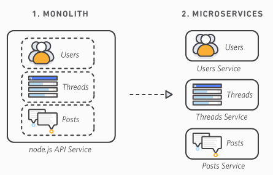

# Monolithique vs Microservice

Source: [AWS - the difference between monolithic and microservices architecture](https://aws.amazon.com/compare/the-difference-between-monolithic-and-microservices-architecture/)

### Quelle est la différence entre une architecture monolithique et une architecture de microservices ? 

Une architecture monolithique est un modèle de développement logiciel traditionnel qui utilise <mark style="color:orange;">une base de code unique pour exécuter plusieurs fonctions métier</mark>. Tous les composants logiciels d'un système monolithique sont <mark style="color:orange;">interdépendants</mark> en raison des mécanismes d'échange de données au sein du système. La modification d'une architecture monolithique est contraignante et prend du temps, car de petites modifications ont un impact sur des pans entiers de la base de code.&#x20;

À l'inverse, les microservices sont une approche architecturale qui consiste à <mark style="color:orange;">décomposer le logiciel en petits composants ou services indépendants</mark>. Chaque service joue un rôle unique et <mark style="color:orange;">communique</mark> avec les autres services <mark style="color:orange;">au moyen d'une interface bien définie</mark>. Comme ils s'exécutent indépendamment, vous pouvez mettre à jour, modifier, déployer ou <mark style="color:orange;">mettre à l'échelle chaque service selon vos besoins</mark>.

### Principales différences : monolithique versus microservices 

Les applications monolithiques se composent généralement d'une interface utilisateur côté client, d'une base de données et d'une application côté serveur. Les développeurs construisent tous ces modules sur une base de code unique.

D'autre part, dans une architecture distribuée, chaque microservice fonctionne pour exécuter une fonctionnalité ou une logique métier unique. Au lieu d'échanger des données au sein de la même base de code, les microservices communiquent via une API.

<figure><figcaption></figcaption></figure>

#### **Processus de développement**

Les applications monolithiques sont <mark style="color:orange;">plus faciles à mettre en œuvre</mark>, car peu de planification préalable est requise. Vous pouvez commencer et continuer à ajouter des modules de code selon vos besoins. <mark style="color:orange;">Toutefois, l'application peut devenir complexe et difficile à mettre à jour ou à modifier dans la durée</mark>.

Une architecture de microservices nécessite davantage de planification et de conception avant de démarrer. Les développeurs doivent identifier les différentes fonctions qui peuvent fonctionner indépendamment et <mark style="color:orange;">planifier des API cohérentes</mark>. Cependant, la coordination initiale rend la <mark style="color:orange;">maintenance du code beaucoup plus efficace</mark>. Vous pouvez apporter des modifications et trouver des bogues plus rapidement. <mark style="color:orange;">La réutilisation du code augmente également au fil du temps</mark>.

#### **Déploiement**

<mark style="color:orange;">Le déploiement d'applications monolithiques est plus simple que le déploiement de microservices</mark>. Les développeurs installent l'ensemble de la base de code de l'application et les dépendances dans un environnement unique.&#x20;

En revanche, le déploiement d'applications basées sur des microservices est plus complexe, car chaque microservice est un package logiciel pouvant être déployé indépendamment. <mark style="color:orange;">Les développeurs conteneurisent généralement les microservices avant de les déployer</mark>. Les conteneurs regroupent le code et les dépendances associées du microservice pour garantir l'indépendance de la plateforme.

#### **Débogage**

Lors du débogage d'une architecture monolithe, le développeur peut suivre le mouvement des données ou examiner le comportement du code au sein du même environnement de programmation. En revanche, <mark style="color:orange;">l'identification des problèmes de codage dans une architecture de microservices nécessite l'examen de plusieurs services individuels faiblement couplés</mark>.&#x20;

Le débogage d'applications de microservices peut s'avérer plus difficile, car plusieurs développeurs peuvent être responsables de nombreux microservices. Par exemple, le débogage peut nécessiter des tests, des discussions et des commentaires coordonnés entre les membres de l'équipe, ce qui demande plus de temps et de ressources.&#x20;

#### **Modifications**

Une petite modification apportée à une partie d'une application monolithique affecte plusieurs fonctions logicielles en raison du codage fortement couplé. De plus, <mark style="color:orange;">lorsque les développeurs apportent de nouvelles modifications à une application monolithique, ils doivent retester et redéployer l'ensemble du système sur le serveur.</mark>

En revanche, l'approche des microservices permet davantage de flexibilité. Il est plus facile d'apporter des modifications à l'application. Au lieu de modifier tous les services, les développeurs ne modifient que des fonctions spécifiques. <mark style="color:orange;">Ils peuvent également déployer des services particuliers de manière indépendante</mark>. Une telle approche est utile <mark style="color:orange;">dans le processus de déploiement continu</mark> où les développeurs apportent fréquemment de petites modifications sans affecter la stabilité du système.

#### **Dimensionnement**

Les applications monolithiques sont confrontées à plusieurs défis à mesure qu'elles évoluent. L'architecture monolithique contient toutes les fonctionnalités au sein d'une base de code unique, de sorte que toute de l'application doit être adaptée à l'évolution des exigences. Par exemple, <mark style="color:orange;">si les performances de l'application se dégradent en raison d'une augmentation du trafic de la fonction de communication, vous devez augmenter les ressources de calcul pour prendre en charge l'ensemble de l'application monolithique</mark>. Il en résulte un gaspillage des ressources, car toutes les parties de l'application ne sont pas exploitées au maximum de leur capacité.

Dans le même temps, l'architecture des microservices prend en charge les systèmes distribués. <mark style="color:orange;">Chaque composant logiciel reçoit ses propres ressources informatiques dans un système distribué</mark>. Ces ressources peuvent être ajustées indépendamment en fonction des capacités actuelles et des demandes prévues. Ainsi, vous pouvez par exemple allouer davantage de ressources à un service de localisation géographique plutôt qu'à l'ensemble du système.

